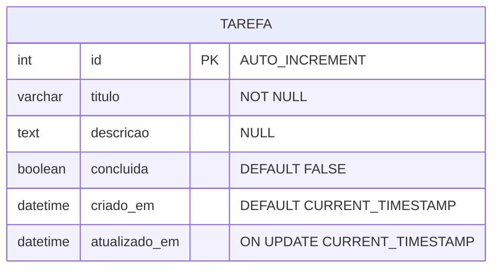

# To-Do List — Projeto Acadêmico

## Visão Geral

Aplicação web simples de lista de tarefas (To-Do List) que permite cadastrar, visualizar, editar, concluir e excluir tarefas.

**Stack:**

| Camada | Tecnologia |
|---|---|
| Front-end | HTML + CSS + JavaScript (vanilla) |
| Back-end | Python (Flask) |
| Banco de Dados | MySQL (via `mysql-connector-python`) |

---

## Requisitos Funcionais

| ID | Requisito | Descrição |
|---|---|---|
| RF01 | Criar tarefa | O usuário deve poder criar uma tarefa informando título e descrição (opcional). |
| RF02 | Listar tarefas | O sistema deve exibir todas as tarefas cadastradas, ordenadas por data de criação. |
| RF03 | Editar tarefa | O usuário deve poder alterar o título e a descrição de uma tarefa existente. |
| RF04 | Concluir tarefa | O usuário deve poder marcar uma tarefa como concluída e desmarcá-la, se necessário. |
| RF05 | Excluir tarefa | O usuário deve poder excluir permanentemente uma tarefa. |

---

## Requisitos Não Funcionais

| ID | Requisito | Descrição |
|---|---|---|
| RNF01 | Usabilidade | A interface deve ser intuitiva e responsiva, funcionando em navegadores desktop e mobile. |
| RNF02 | Desempenho | As operações de CRUD devem responder em menos de 1 segundo em condições normais de uso. |
| RNF03 | Segurança | As consultas ao banco devem utilizar queries parametrizadas para prevenir SQL Injection. |
| RNF04 | Portabilidade | O sistema deve funcionar em qualquer SO com Python 3.8+ e MySQL instalados. |
| RNF05 | Manutenibilidade | O código deve seguir boas práticas de organização (separação front-end / back-end, rotas claras, código comentado). |
| RNF06 | Compatibilidade | A interface deve funcionar nos navegadores Chrome, Firefox e Edge em suas versões mais recentes. |

---

## Diagrama Entidade-Relacionamento (ER)



### Descrição da Entidade

- **TAREFA**: Entidade única do sistema. Armazena o título, descrição opcional, status de conclusão e datas de controle (criação e última atualização).

## Como Rodar o Projeto

### Pré-requisitos

- Python 3.8+
- MySQL Server instalado e rodando

### 1. Configurar o banco de dados

Edite o arquivo `back-end/db.py` e preencha as credenciais do seu MySQL:

```python
DB_CONFIG = {
    'host': 'localhost',
    'port': 3306,
    'user': 'root',
    'password': 'SUA_SENHA',
    'database': 'todo_list'
}
```

### 2. Instalar dependências

```bash
cd back-end
pip install -r requirements.txt
```

### 3. Iniciar o servidor

```bash
cd back-end
python ./main.py
```

O banco `todo_list` e a tabela `tarefa` serão criados automaticamente na primeira execução. O servidor Flask ficará disponível em `http://localhost:5000`.

### 4. Abrir o front-end

Abra o arquivo `front-end/index.html` diretamente no navegador.
